# Домашнее задание к занятию «Docker в работе» - Моськов Максим

Выполнял на своей виртуальной машине в VirtualBox (локальная часть) и на ВМ в Yandex Cloud (облачная часть, Задача 4 и звёздочки).

Все скриншоты лежат в каталоге `img/`.

## Окружение

**Локальная ВМ (VirtualBox):**
- ОС: Debian GNU/Linux 12, ядро `6.1.0-29-amd64`.
- Docker: `20.10.24+dfsg1`, плагин Docker Compose: `v5.1.4`.
- Пользователь `max` состоит в группе `docker`, поэтому docker-команды выполняю без `sudo`.

**Облачная ВМ (Yandex Cloud):**
- ОС: Ubuntu 24.04, внешний IP `158.160.221.214`, зона `ru-central1-d`.
- Docker `29.5.2` (поставил скриптом `get.docker.com`) + `git`. Пользователь `yc-user`.

**Репозиторий с решением (форк):** https://github.com/Maxim-Moskov/docker-in-practive-05-hw

В форк я добавил 5 файлов, исходные файлы проекта (`main.py`, `requirements.txt`, `proxy.yaml`, `.env`) не трогал:
`Dockerfile.python`, `compose.yaml`, `deploy.sh`, `.dockerignore`, `.gitignore`.

---

## Задача 0

Проверил, что отдельная утилита `docker-compose` (с дефисом) **не установлена**, а используется плагин `docker compose` (без дефиса) актуальной версии:

```bash
docker-compose version   # command not found
docker compose version   # Docker Compose version v5.1.4
```

Версия плагина `v5.1.4` выше требуемого минимума, отдельный `docker-compose` я никогда не ставил.

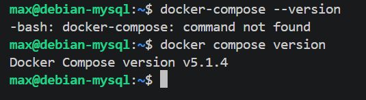

---

## Задача 1

Написал **multistage** `Dockerfile.python` для сборки образа python-приложения. Обязательная по заданию конструкция `COPY . .` присутствует.

```dockerfile
# syntax=docker/dockerfile:1

# ---- Stage 1: builder — ставим зависимости в отдельное venv ----
FROM python:3.12-slim AS builder

WORKDIR /app

# Сначала только requirements.txt, чтобы слой с зависимостями кэшировался
COPY requirements.txt .

RUN python -m venv /opt/venv
ENV PATH="/opt/venv/bin:$PATH"
RUN pip install --no-cache-dir --upgrade pip \
    && pip install --no-cache-dir -r requirements.txt

# ---- Stage 2: final — лёгкий образ только с venv и кодом ----
FROM python:3.12-slim

WORKDIR /app

# Переносим готовое venv из builder (без pip-кэша и build-инструментов)
COPY --from=builder /opt/venv /opt/venv
ENV PATH="/opt/venv/bin:$PATH"

# Обязательная по заданию конструкция COPY . .
COPY . .

# Запуск приложения через uvicorn
CMD ["uvicorn", "main:app", "--host", "0.0.0.0", "--port", "5000"]
```

Сборка:
```bash
docker build -f Dockerfile.python -t shvirtd-web:latest .
```

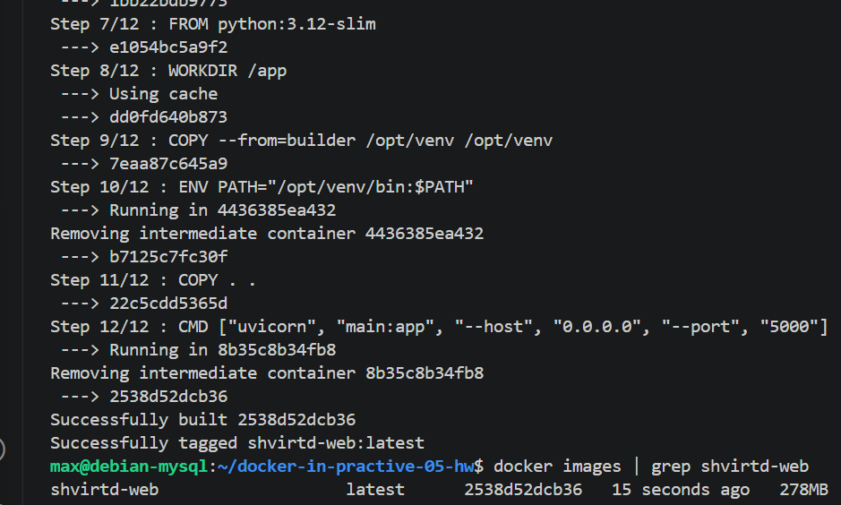

**Зачем multistage?** Зависимости ставятся в стадии `builder`, а в финальный образ переносится только готовое venv (`COPY --from=builder`). Благодаря этому в итоговый образ не попадают pip-кэш и временные файлы сборки — образ получается заметно легче. Дополнительно: `requirements.txt` копируется отдельным слоем перед кодом, поэтому при изменении только кода слой с зависимостями берётся из кэша и пересборка идёт быстрее.

---

## Задача 3 (локальный запуск)

Написал `compose.yaml`, который через `include` подключает `proxy.yaml` (там описаны reverse-proxy на HAProxy и ingress-proxy на Nginx, а также сеть `backend`), и добавляет два своих сервиса — `web` и `db`:

```yaml
include:
  - proxy.yaml

services:
  web:
    build:
      context: .
      dockerfile: Dockerfile.python
    image: shvirtd-web:latest
    container_name: web
    restart: always
    env_file:
      - .env
    environment:
      DB_HOST: db
      DB_USER: ${MYSQL_USER}
      DB_PASSWORD: ${MYSQL_PASSWORD}
      DB_NAME: ${MYSQL_DATABASE}
    networks:
      backend:
        ipv4_address: 172.20.0.5

  db:
    image: mysql:8
    container_name: db
    restart: always
    env_file:
      - .env
    networks:
      backend:
        ipv4_address: 172.20.0.10
```

Запуск стека:
```bash
docker compose up -d
docker compose ps
```

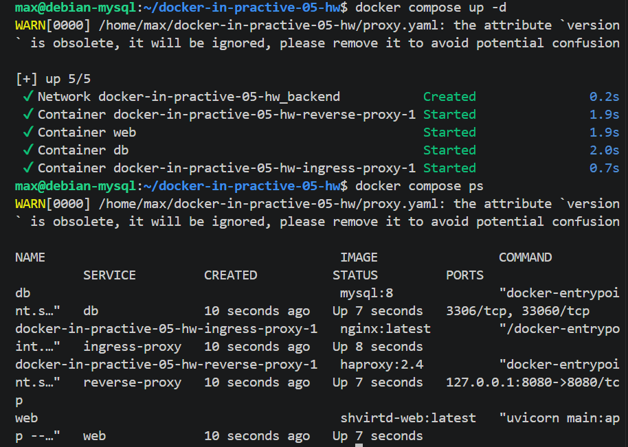

Проверил, что приложение доступно через цепочку прокси (Nginx слушает `8090`):
```bash
curl http://127.0.0.1:8090
```
В ответ приходит строка с датой и IP клиента.

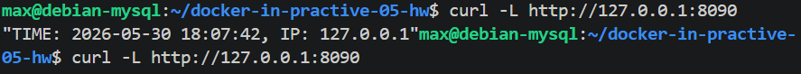

Проверил, что запрос записался в БД:
```bash
docker exec -ti db mysql -uroot -p
```
```sql
show databases;
use virtd;
show tables;
SELECT * from requests LIMIT 10;
```

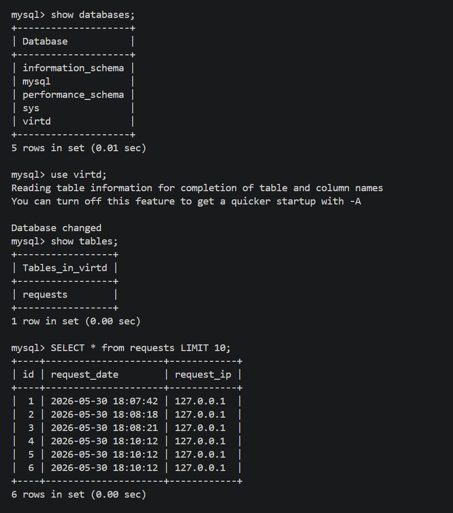

Остановил стек:
```bash
docker compose down
```

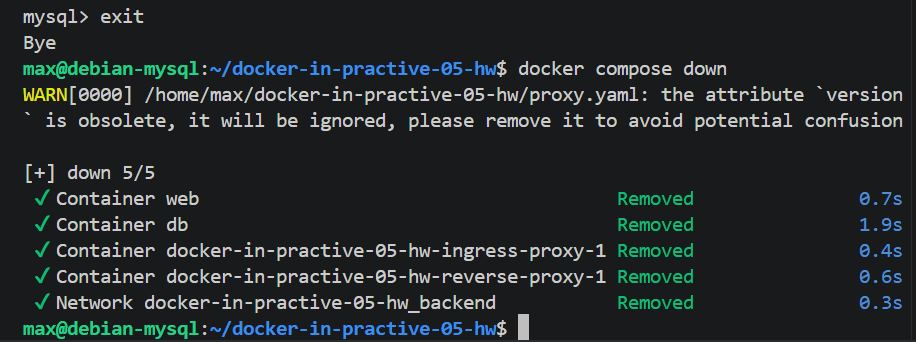

**Пояснения по вопросам задачи:**
- **`include`**: директива `include` в `compose.yaml` подтягивает `proxy.yaml` как часть общей конфигурации, поэтому одной командой `docker compose up -d` поднимается весь стек (Nginx → HAProxy → web → MySQL). Сеть `backend` (подсеть `172.20.0.0/24`) описана в `proxy.yaml`, и оба моих сервиса подключаются к ней по статическим адресам.
- **Секреты**: логины/пароли вынесены в `.env` и подставляются в `environment` через `${MYSQL_USER}` / `${MYSQL_PASSWORD}` / `${MYSQL_DATABASE}`.
- **Почему при локальном `curl` IP = `127.0.0.1`**: запрос идёт с самой машины (localhost). Приложение определяет IP клиента из заголовка `X-Real-IP`, который проставляет Nginx и пробрасывает HAProxy, — поэтому для локального запроса фиксируется `127.0.0.1`, а для внешних запросов будут реальные внешние адреса (см. Задачу 4).

---

## Задача 4 (запуск в облаке)

Запушил все файлы в форк, на ВМ в Yandex Cloud установил docker и git, склонировал репозиторий и запустил стек скриптом `deploy.sh`.

Скрипт `deploy.sh` (Задача 4.3) клонирует/обновляет репозиторий в `/opt` и поднимает стек:

```bash
#!/usr/bin/env bash
set -euo pipefail

REPO_URL="https://github.com/Maxim-Moskov/docker-in-practive-05-hw.git"
TARGET_DIR="/opt/docker-in-practive-05-hw"

# Скачиваем (или обновляем) репозиторий в /opt
if [ -d "$TARGET_DIR/.git" ]; then
    echo "Репозиторий уже есть в $TARGET_DIR, обновляю..."
    git -C "$TARGET_DIR" pull
else
    echo "Клонирую репозиторий в $TARGET_DIR ..."
    git clone "$REPO_URL" "$TARGET_DIR"
fi

# Запускаем стек
cd "$TARGET_DIR"
docker compose up -d
docker compose ps
```

Запушил файлы в форк:
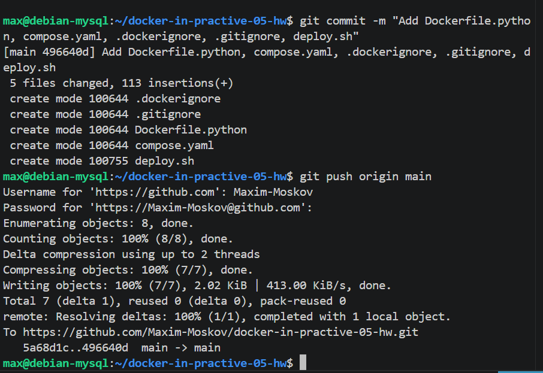

Установил docker и git на облачной ВМ:
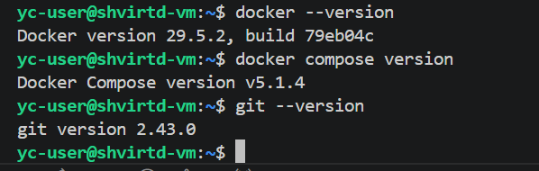

Запустил деплой:
```bash
sudo bash deploy.sh
```
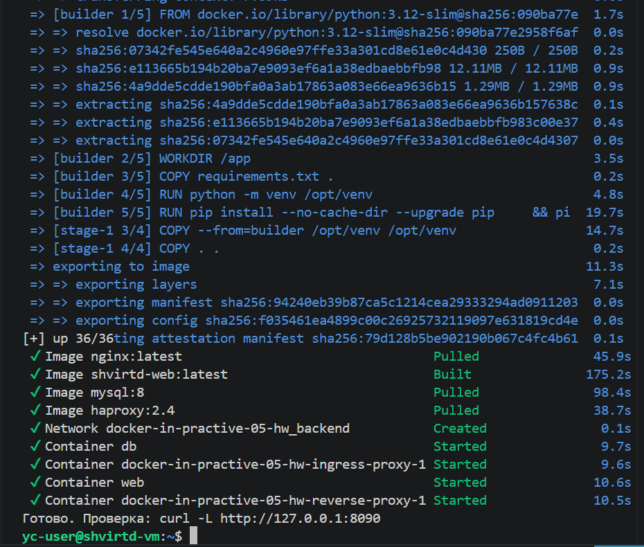

Проверил доступность локально на ВМ:
```bash
curl http://127.0.0.1:8090
```
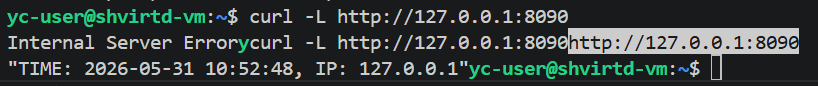

В security group открыл порт `8090` (а также `22`) для `0.0.0.0/0` и проверил доступность снаружи через **check-host.net** (`http://158.160.221.214:8090`) — все узлы вернули код `200 OK`:

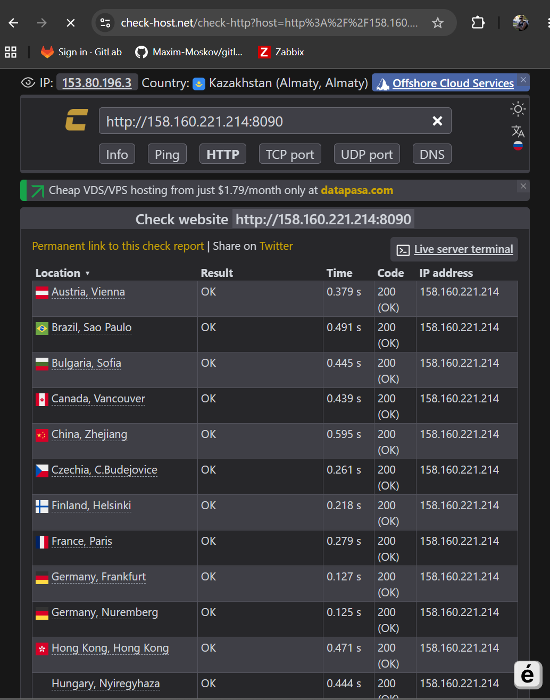

После внешней проверки в таблице `requests` появились реальные внешние IP узлов check-host (а не только локальный `127.0.0.1`) — значит внешний трафик прошёл всю цепочку и записался в БД:

```sql
SELECT * from requests LIMIT 10;
```
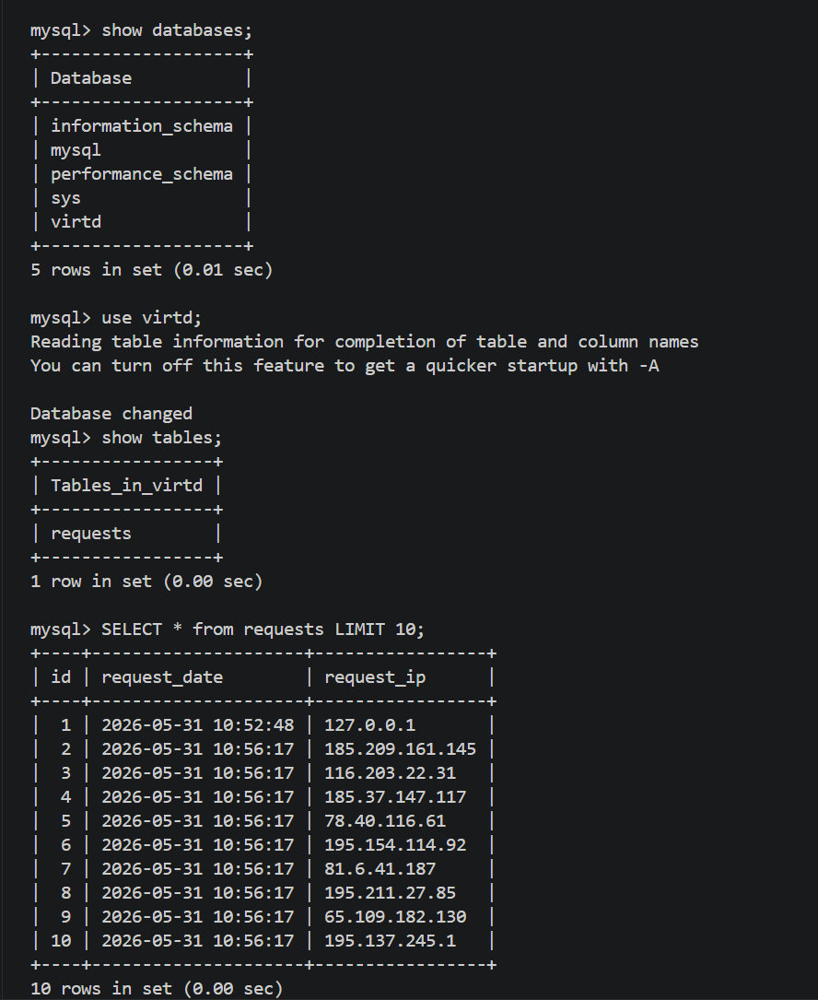

### Задача 4.5 (необязательная) — удалённое управление docker через ssh-контекст

С локальной машины создал docker-контекст, указывающий на облачную ВМ по SSH, и выполнил `docker ps -a` удалённо, не заходя в ssh:

```bash
docker context create yc-vm --docker "host=ssh://yc-user@158.160.221.214"
docker context ls
docker --context yc-vm ps -a
```

Команда выполняется локально, но показывает контейнеры на облачной ВМ (web, db, reverse-proxy, ingress-proxy):

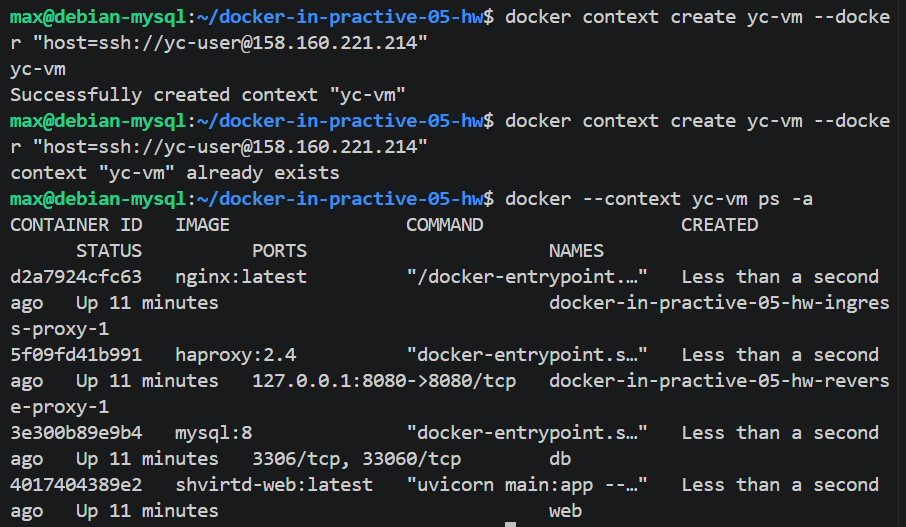


---

## Задача 6

Нужно вытащить бинарник `/bin/terraform` из образа `hashicorp/terraform:latest` двумя способами.

Скачал образ и установил утилиту `dive` для просмотра слоёв:
```bash
docker pull hashicorp/terraform:latest
dive hashicorp/terraform:latest
```
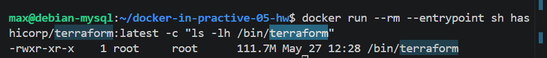

Проверил расположение и размер бинарника (`111.7M` — это полноценный бинарник, а не busybox-симлинк):
```bash
docker run --rm --entrypoint sh hashicorp/terraform:latest -c "ls -lh /bin/terraform"
```

### Способ 1 — через `docker save`

`docker save` выгружает образ в tar-архив со всеми слоями; дальше распаковываю архив, нахожу слой с `bin/terraform` и извлекаю только его — **без запуска контейнера**:

```bash
mkdir -p ~/tf-save && cd ~/tf-save
docker save hashicorp/terraform:latest -o terraform-image.tar
mkdir -p unpacked && tar -xf terraform-image.tar -C unpacked

for layer in unpacked/*/layer.tar unpacked/blobs/sha256/*; do
  [ -f "$layer" ] || continue
  if tar -tf "$layer" 2>/dev/null | grep -qx 'bin/terraform'; then
    echo ">>> bin/terraform найден в слое: $layer"
    tar -xf "$layer" -C . bin/terraform
    break
  fi
done

ls -lh bin/terraform
./bin/terraform version    # Terraform v1.15.5
```

(У моего локального docker `20.10` классический формат архива — слои лежат в `unpacked/<хеш>/layer.tar`, а не в `blobs/sha256/`, это учтено в цикле.)

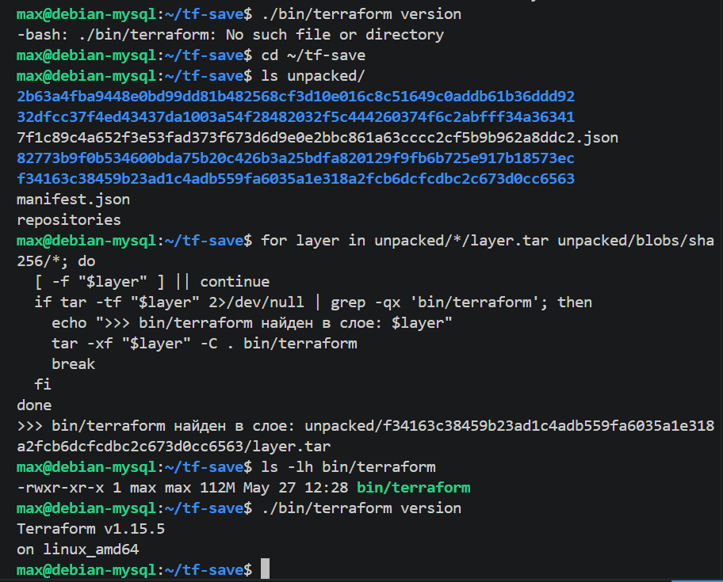

### Задача 6.1 — тот же результат через `docker cp`

`docker create` делает контейнер из образа (не запуская его), `docker cp` копирует файл на хост, контейнер удаляю:

```bash
docker create --name tf-tmp hashicorp/terraform:latest
docker cp tf-tmp:/bin/terraform ./terraform-cp
docker rm tf-tmp

ls -lh terraform-cp
./terraform-cp version     # Terraform v1.15.5
```


Оба способа дали один и тот же бинарник `Terraform v1.15.5`.

---

## Задача 2 (необязательная) — Yandex Container Registry + сканирование уязвимостей

Делал на облачной ВМ. Установил `yc` CLI и инициализировал профиль:
```bash
curl -sSL https://storage.yandexcloud.net/yandexcloud-yc/install.sh | bash
exec -l $SHELL
yc init     # каталог main, зона ru-central1-d
```
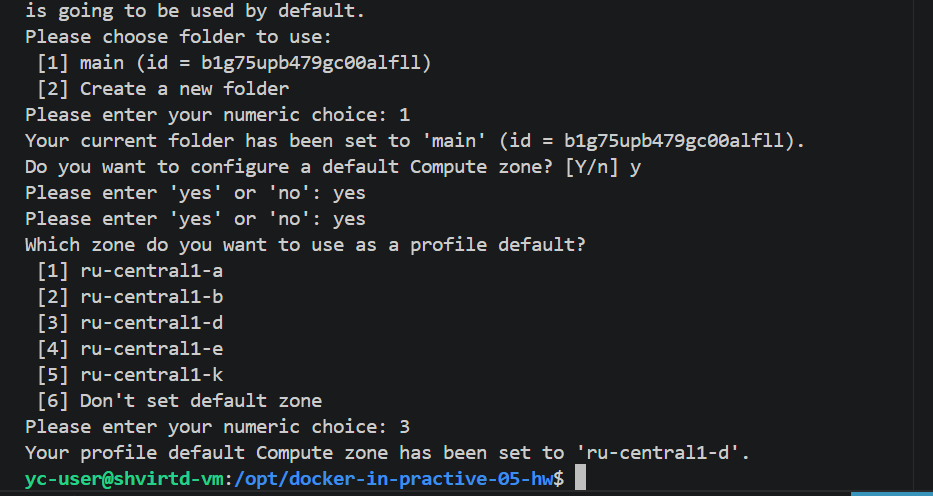

Создал реестр и настроил аутентификацию docker:
```bash
yc container registry create --name test
yc container registry list           # ID: crps7os7qksqev47ids6
yc container registry configure-docker
```

Образ python-приложения из Задачи 1 я собрал и запушил в реестр. Важный момент: docker `29.5` через BuildKit по умолчанию пушит образ как **OCI image index** (`application/vnd.oci.image.index.v1+json`) с provenance-аттестацией, а сканер Yandex такой индекс не поддерживает. Поэтому пересобрал и запушил образ **без provenance-аттестации** (`--provenance=false`) — тогда в реестр уходит одиночный манифест:

```bash
docker buildx build --provenance=false --push \
  -t cr.yandex/crps7os7qksqev47ids6/shvirtd-web:1.0.0 \
  -f Dockerfile.python .
```

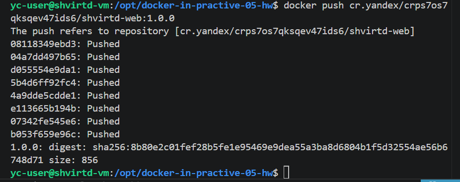

Запустил сканирование образа на уязвимости и получил отчёт:
```bash
yc container image list --registry-id crps7os7qksqev47ids6
yc container image scan crpc63lv678tjurgppl0
# status: READY — critical: 2, high: 7, medium: 29, low: 63, undefined: 4

yc container image list-vulnerabilities --scan-result-id chegav5ujrmpmt2krs74
```

Отчёт с конкретными уязвимостями (severity, пакет, версия, CVE) — видны 2 CRITICAL (`CVE-2026-42496`, `CVE-2026-8376`) и набор HIGH:

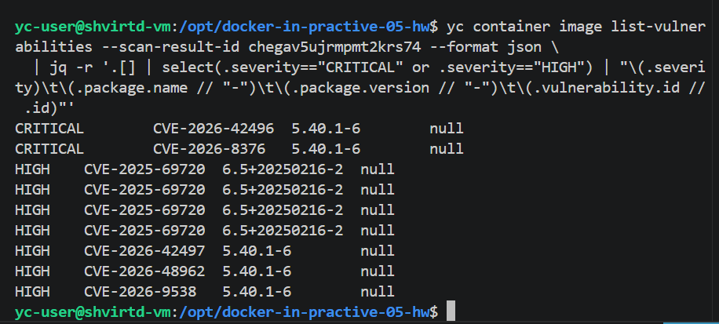

---

## Задача 5 (необязательная) — резервное копирование MySQL + cron

Делал на облачной ВМ. Бэкап снимаю образом `schnitzler/mysqldump` в каталог `/opt/backup`.

**Нюанс с MySQL 8.4.** Образ `mysql:8` подтянул версию 8.4, где плагин `mysql_native_password` по умолчанию выключен, а образ `schnitzler/mysqldump` основан на MariaDB-клиенте, который не умеет дефолтный для MySQL 8 плагин `caching_sha2_password`. Поэтому в сервис `db` я добавил опцию запуска `command: ["--mysql-native-password=ON"]`, пересоздал контейнер и переключил пользователя `root@'%'` на `mysql_native_password`:

```bash
docker compose up -d
docker exec db mysql -uroot -pYtReWq4321 \
  -e "ALTER USER 'root'@'%' IDENTIFIED WITH mysql_native_password BY 'YtReWq4321'; FLUSH PRIVILEGES;"
```

**Ручной бэкап** одной командой `docker run` (контейнер mysqldump подключаю к сети `backend`, чтобы он видел `db` по имени):

```bash
docker run --rm \
  --network docker-in-practive-05-hw_backend \
  --entrypoint "" \
  -v /opt/backup:/backup \
  schnitzler/mysqldump \
  sh -c 'mysqldump --opt -h db -u root -pYtReWq4321 virtd > /backup/virtd_$(date +%Y-%m-%d_%H-%M-%S).sql'
```

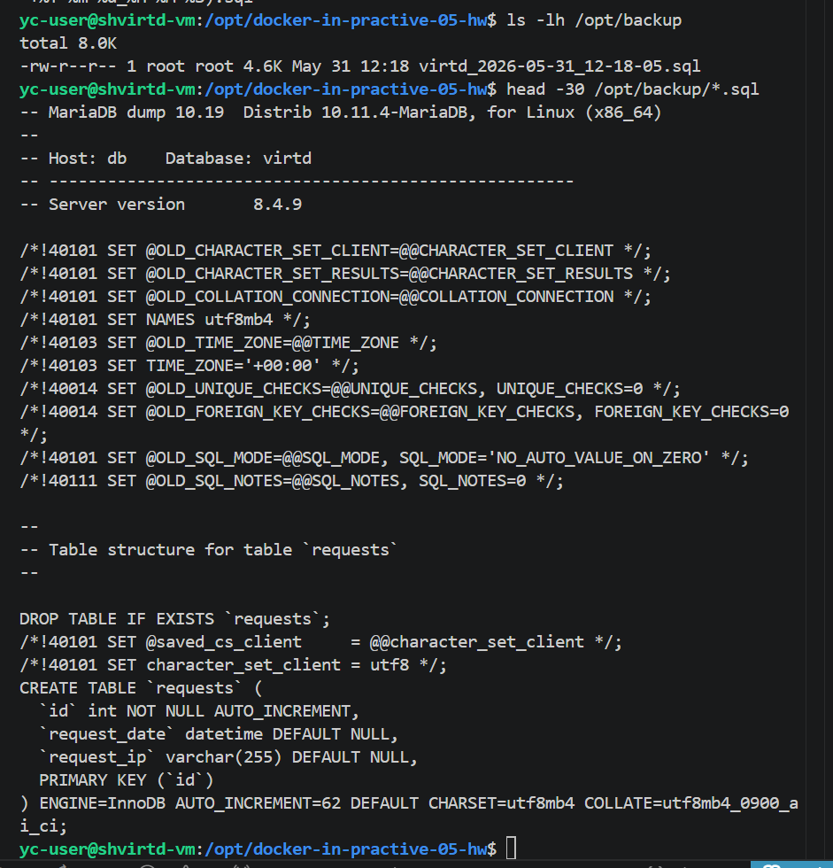

**Скрипт бэкапа `/opt/backup.sh`.** Чтобы не светить пароль в git, скрипт **не содержит пароля** — он подтягивает его из `.env` проекта в момент запуска и передаёт в контейнер через переменную `MYSQL_PWD` (её mysqldump читает автоматически):

```bash
#!/usr/bin/env bash
set -euo pipefail
export PATH=/usr/local/sbin:/usr/local/bin:/usr/sbin:/usr/bin:/sbin:/bin

PROJECT_DIR="/opt/docker-in-practive-05-hw"
BACKUP_DIR="/opt/backup"
NETWORK="docker-in-practive-05-hw_backend"
DB_NAME="virtd"

# Секреты берём из .env проекта — в самом скрипте паролей нет
set -a
. "${PROJECT_DIR}/.env"
set +a

mkdir -p "${BACKUP_DIR}"
STAMP=$(date +%Y-%m-%d_%H-%M-%S)

docker run --rm \
  --network "${NETWORK}" \
  --entrypoint "" \
  -e MYSQL_PWD="${MYSQL_ROOT_PASSWORD}" \
  -v "${BACKUP_DIR}:/backup" \
  schnitzler/mysqldump \
  sh -c "mysqldump --opt -h db -u root ${DB_NAME} > /backup/virtd_${STAMP}.sql"
```

**Cron-задача** (раз в минуту, в root-crontab):
```
* * * * * /opt/backup.sh >> /var/log/db-backup.log 2>&1
```

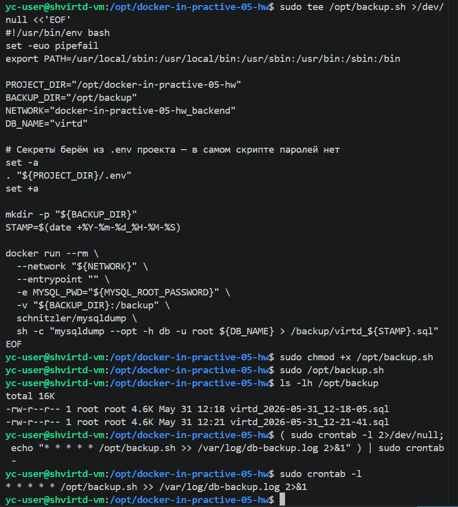

Через несколько минут в `/opt/backup` накопились резервные копии — по одной в минуту, что подтверждает работу cron:

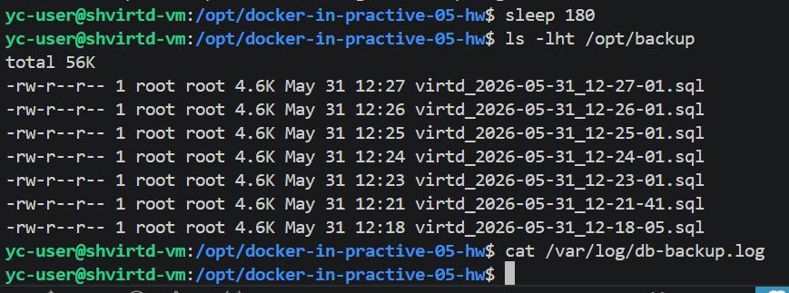

---

## Итог

Выполнены обязательные задачи **0, 1, 3, 4** (включая 4.5) и **6, 6.1**, а также задачи со звёздочкой **2** (Yandex Container Registry + сканирование) и **5** (резервное копирование MySQL + cron).
